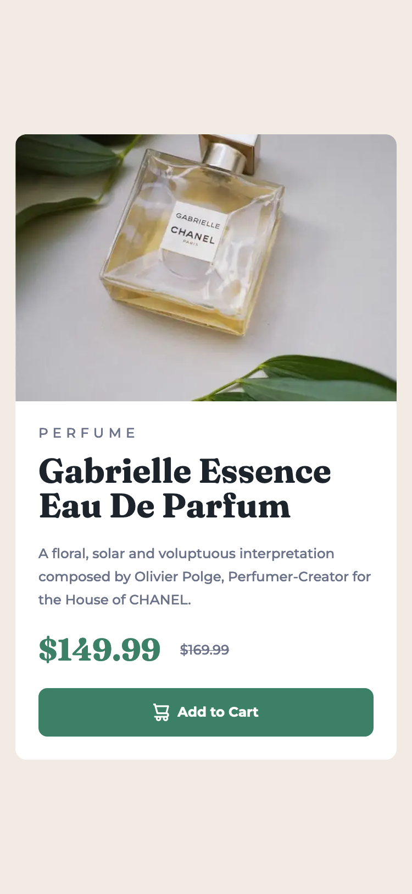
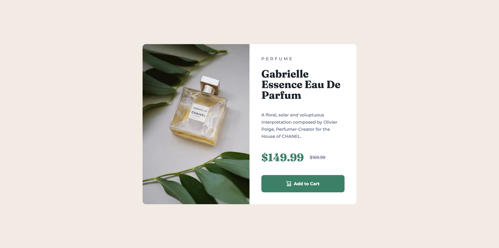

# Frontend Mentor - Product preview card component solution

This is a solution to the [Product preview card component challenge on Frontend Mentor](https://www.frontendmentor.io/challenges/product-preview-card-component-GO7UmttRfa). Frontend Mentor challenges help you improve your coding skills by building realistic projects.

## Table of contents

- [Frontend Mentor - Product preview card component solution](#frontend-mentor---product-preview-card-component-solution)
  - [Table of contents](#table-of-contents)
  - [Overview](#overview)
    - [The challenge](#the-challenge)
    - [Screenshot](#screenshot)
    - [Links](#links)
  - [My process](#my-process)
    - [Built with](#built-with)
    - [What I learned](#what-i-learned)
    - [Continued development](#continued-development)
  - [Author](#author)

## Overview

### The challenge

Users should be able to:

- View the optimal layout depending on their device's screen size
- See hover and focus states for interactive elements

### Screenshot

Desktop:

Mobile:

### Links

- Solution URL: [GitHub](https://github.com/PatricioZarauz/product-preview-card-component-main)
- Live Site URL: [Vercel](https://product-preview-card-component-main-zeta-lime.vercel.app)

## My process

### Built with

- Semantic HTML5 markup
- CSS custom properties
- Flexbox
- CSS Grid
- Mobile-first workflow
- SASS

### What I learned

The thing that I learned was the usage of background-image for adding custom gradient to the button, without having to create special colors.

### Continued development

I would like to get some feedback regarding on how to cleanup or simplify the code and how to make it more accessible.

## Author

- Website - [Add your name here](https://www.your-site.com)
- Frontend Mentor - [@PatricioZarauz](https://www.frontendmentor.io/profile/PatricioZarauz)
